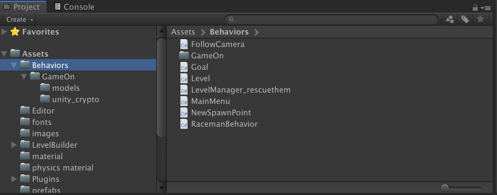
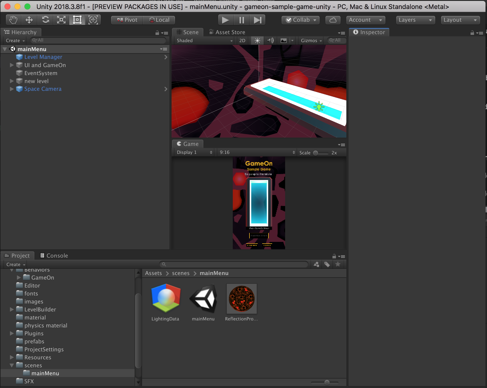
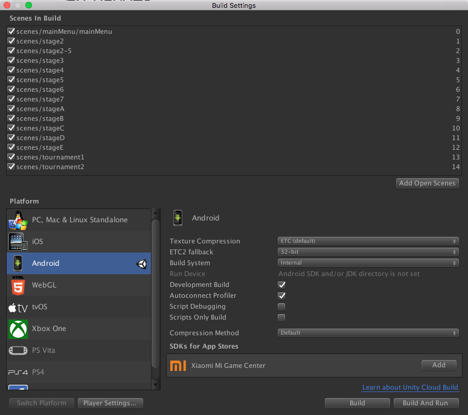

# GameOn Unity Sample Game

**What is GameOn?**

GameOn is a REST API that enables game developers to run and manage tournaments on the cloud while enabling key features like:
- Real world prizes fulfilled by Amazon.com
- Streamer generated tournaments through Twitch.

Here is a simple game that incorporates the GameOn APIs to give developers an idea on how to create such experiences.

For more details about GameOn please consult

* [GameOn Features](https://developer.amazon.com/gameon/features)

* [GameOn Documentation](https://developer.amazon.com/docs/gameon/overview.html)

## Getting Started

### Prerequisites

- Latest verison of Unity that can be downloaded from [here](https://unity3d.com/get-unity/download). This sample game was tested using Unity 2018.2.15f1.
- The game was tested on Android, but one should be able to port it to other platforms too.

### Setup

There are two sets of files under Behaviors folder.

#### GameOn behavior

The GameOn behavior code is located in the Assets -\> Behaviors -\> GameOn folder.

- /Unity\_crypto -\> BouncyCastle.Crypto.dll : This is the BouncyCastle encryption library for C\#. We will be using this library to encrypt and decrypt payloads.

 - GameOnTools.cs: This is a wrapper class that will expose the BouncyCastle library to the rest of the game behaviors.

 - /Models: These are classes that are used to parse JSON to and from the GameOn APIs.

 - TournamentManager.cs: this is attached to the GameOn tournament details canvas. It will manage the data to be shown to the player when the canvas is enabled. It also manages the buttons on that canvas.

 - MatchesManager.cs: this is attached to the GameOn match details canvas. It will manage the data to be shown to the player when the canvas is enabled. It also manages the buttons on that canvas.

- GameOnManager.cs : Here is where most of the magic happens. Attaching this component to your GameObject will expose to you 2 editor fields that you can edit, including GameOn public key, GameOn API key. You can also see inspect some session id, and player name there when you get one. The other exposed variables there are UI elements and should not be edited.

  #### GameOnManager

  - The library has 3 generic functions to do POST, GET, PUT 

  - The class has a Registration and Authentication functions.

  - OnEnable() runs when the object the behavior is attached to is enabled, and that is when the player clicks on the tournaments button in the main menu.’

  - getSession() creates public and private keys and registers the device, if it has not been previously registered.

  - The game authenticates the player each time the GameOn Manager is enabled, which is not the best practice. You should only authenticate players around once a week.

  - After authenticating, the manager gets the tournament list, as well as the list of player tournaments.

  - If a tournament button is pressed, a Tournament Manager object gets enabled, which starts the OnEnable function on TournamentManager.cs

  - TournamentManager.cs is a class that manages the tournament specific UI, and uses the GameOn Manager in that specific context, calling the GetTournamentData function, which fills the UI with more tournament info.

  - When a joining a tournament, the GameOn Manager function EnterTournament gets invoked, and GameOn Manager takes over again.

  - GetTournamentData() and GetPlayerTournamentData() are interesting because they detects if the tournament requires a passcode, or in the case of a player tournament, if a twitch link needs to be made.

  - EnterTournament() and EnterPlayerTournament() enters the player into a tournament, or enters a match if the player has already joined the tournament. Then the function switches to the scene name that has been filled in the metadata field when creating a tournament, or to a random level in case of a player generated tournament.

  - When an attempt is made, SubmitScore() is called by the LevelManager\_rescuethem.cs class. Submit score will submit the score, and on success, it will enable the match UI object, and then calls GetMatchData()

  - GetMatchData() will get the leaderboard, and fill the UI object with the details of the attempt. If there are more attempts, it will ask the player to play again.

  - If the Prizes button is pressed on the tournament list view, the Prizes UI gets enabled, which enables the GetPrizesCanvas.cs class.

  - When enabling GetPrizesCanvas.cs, the GameOn function GetPrizesToClaim() gets invoked, which gets the list of prizes that are unclaimed, then lists the prizes in the UI.

  - When a prize listed is pressed, the prize details canvas gets enabled, which enables the PrizeDetailsScript.cs which calls the GameOn Manager GetPrizeData() function, which lists details about the prize, and allows the player to fulfill the prize by clicking on the external link taking them to the GameOn checkout process.
  
#### Game behavior

- FollowCamera.cs: This class is attached to the camera to follow the main player, and to be limited to the level boundaries.

- Goal.cs: This is attached to an object that when touched, would trigger the a win state.

- Level.cs: This is attached to a level to give the object with FollowCamera attached to it boundaries.

- NewSpawnPoint.cs: An object with this attached to it will become the new checkpoint onEnterTrigger.

### Running the Game
- Open the solution with a supported Unity3D Game Engine.
- Start the "mainMenu" scene from the scenes folder

  

- Make sure that the Scenes in the build settings look like this:

  
  
### Security Consideration

The game implements GameOn calls directly from the client, which is not the most secure. Its suggested to use a server in-between the client and the GameOn API.

## Contributing

Please read [CONTRIBUTING.md](https://gist.github.com/PurpleBooth/b24679402957c63ec426) for details on our code of conduct, and the process for submitting pull requests to us.

## License

This project is licensed under the MIT License - see the [LICENSE](LICENSE) file for details

By downloading the GameOn Unity Sample Game, you agree to Amazon’s [Conditions of Use](https://www.amazon.com/gp/help/customer/display.html?nodeId=508088), [Terms of Use](https://www.amazon.com/gp/help/customer/display.html?nodeId=201485660), and [Privacy Notice](https://www.amazon.com/gp/help/customer/display.html?nodeId=468496).

[Bouncy Castle license](http://www.bouncycastle.org/csharp/licence.html) applies to both the source code and the game.